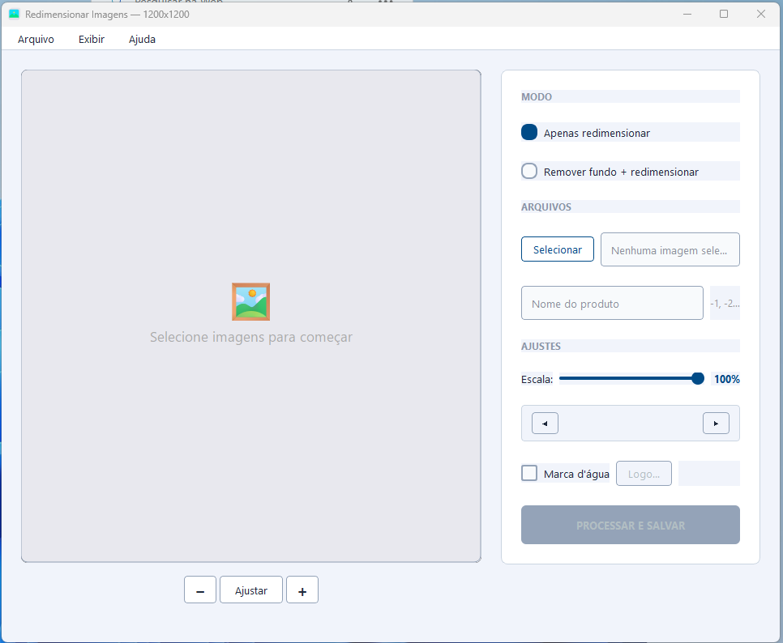

# LS Imagecomm

Ferramenta desktop **offline** para redimensionar imagens para **1200×1200**, remover fundo com **IA** (BiRefNet-general) e adicionar **marca d'água**.

> Totalmente offline — suas imagens nunca saem do seu computador.



## Funcionalidades

| Recurso | Descrição |
|---------|-----------|
| **Redimensionar** | Corta e redimensiona para 1200×1200 com limite de 2MB |
| **Remover fundo** | Remove fundo com IA via BiRefNet-general (máx 350KB) |
| **Marca d'água** | Grade diagonal do seu logo (PNG) sobre a imagem |
| **Corte visual** | Seletor de corte com zoom, pan e alças redimensionáveis |
| **Corte individual** | Cada imagem mantém seu próprio corte salvo |
| **Escala do produto** | Controle do tamanho do produto no canvas 1200×1200 |
| **Renomeação SEO** | Nome base + numeração automática (`produto-1.jpg`) |
| **Tema escuro** | Alternância rápida no menu Exibir |
| **Cancelamento** | Botão para cancelar processamento em andamento |
| **Atalhos** | Ctrl+O, Ctrl+S, Ctrl++/-, ←/→ |
| **Notificações** | Balão no system tray + barra de progresso no Windows |
| **Logs** | Log rotativo em `~/.ls-imagecomm/logs/` para diagnóstico |
| **Offline** | Sem nuvem, sem internet, sem contas — 100% local |

## Downloads

| Versão | Link |
|--------|------|
| **Instalador (recomendado)** | `dist/LS Imagecomm Setup.exe` (após build) |
| Código-fonte | [GitHub](https://github.com/paulofelixpc/redimensionar-imagens) |

## Instalação (desenvolvedor)

```bash
git clone https://github.com/paulofelixpc/redimensionar-imagens
cd redimensionar-imagens
python -m venv .venv
.venv\Scripts\pip install -e .
.venv\Scripts\python -m redimensionar
```

### Build do executável

```bash
.venv\Scripts\pyinstaller "Redimensionar Imagens.spec"
```

### Build do instalador NSIS

```bash
makensis installer.nsi
```

> Requer [NSIS](https://nsis.sourceforge.io) instalado com `makensis` no PATH.

## Como usar

1. **Abrir imagens** — `Ctrl+O` ou botão "Selecionar"
2. **Ajustar corte** — Arraste o quadrado ou as alças nos cantos; use zoom `− Ajustar +`
3. **Navegar** — Botões ◀ ▶ no painel direito para ajustar cada imagem individualmente
4. **Modo** — Selecione "Apenas redimensionar" ou "Remover fundo + redimensionar"
5. **Escala** (modo remover fundo) — Ajuste o tamanho do produto no canvas 1200×1200
6. **Marca d'água** — Marque a opção e selecione o logo (PNG com transparência)
7. **Nome base** — Preenchido automaticamente com o nome do primeiro arquivo
8. **Processar** — `Ctrl+S`, escolha a pasta de destino

### Atalhos

| Tecla | Ação |
|-------|------|
| `Ctrl+O` | Abrir imagens |
| `Ctrl+S` | Processar e salvar |
| `Ctrl++` | Zoom in |
| `Ctrl+-` | Zoom out |
| `Ctrl+0` | Ajustar zoom à janela |
| `← / →` | Navegar entre imagens |

## Estrutura do projeto

```
src/redimensionar/
├── __init__.py
├── __main__.py         # Ponto de entrada
├── app.py              # Interface gráfica (PySide6)
├── crop_widget.py      # Widget de corte com zoom/pan
├── image_processor.py  # Processamento (Pillow + rembg + BiRefNet)
├── theme.py            # Sistema de temas (claro/escuro)
├── logger.py           # Logging rotativo
├── history.py          # Histórico (não utilizado atualmente)
├── app_icon.png        # Ícone da aplicação
├── app_icon.ico        # Ícone para o instalador
```

## Stack

| Tecnologia | Versão | Uso |
|------------|--------|-----|
| Python | ≥ 3.10 | Runtime |
| PySide6 | ≥ 6.6 | Interface gráfica |
| Pillow | ≥ 12.0 | Processamento de imagem |
| rembg | ≥ 2.0 | Remoção de fundo (BiRefNet-general) |
| NSIS | 3.x | Instalador Windows |

## Licença

Distribuído sob a licença **MIT**. Consulte o arquivo [LICENSE](LICENSE) para os termos completos.

---

**LS Imagecomm** — Redimensione, remova fundo e publique. Tudo offline.
